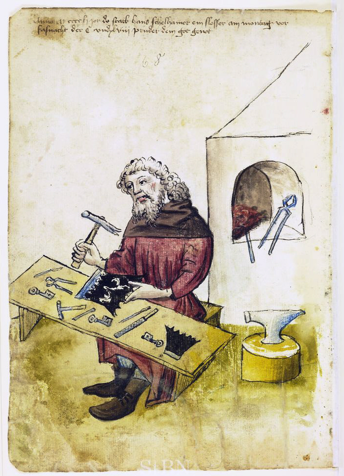

#  Locksmith

Generate certificates and keys easily. A tiny wrapper over the excellent [okhttp-tls](https://github.com/square/okhttp/tree/master/okhttp-tls).
To be used together with [nREPL](https://github.com/nrepl/nrepl).

[](https://clojars.org/com.github.ivarref/locksmith)

## Usage

```bash
clojure -Ttools install com.github.ivarref/locksmith '{:mvn/version "0.1.6"}' :as locksmith

clojure -Tlocksmith write-certs!

```
